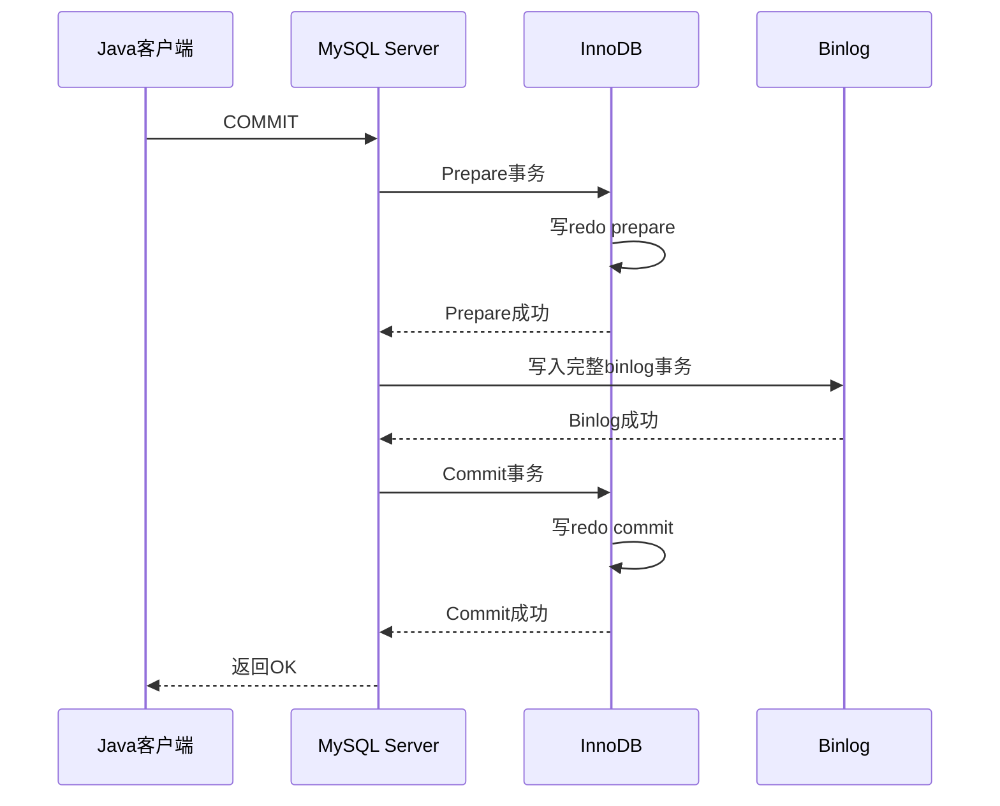

# MySQL 两阶段提交：从事务执行到崩溃恢复

MySQL 中常说的“两阶段提交”，是指 MySQL 为了保证 **InnoDB redo log 与 Server 层 binlog 一致**，将事务提交分为 `prepare` 和 `commit` 两个阶段。

它不是用于协调多个数据库的分布式事务，而是 MySQL 实例内部的日志一致性协议。

## 一、为什么需要两阶段提交

一次更新会涉及两套日志：

| 日志     | 所属模块     | 主要作用                |
| -------- | ------------ | ----------------------- |
| redo log | InnoDB       | 崩溃恢复、事务持久性    |
| binlog   | MySQL Server | 主从复制、增量备份、CDC |
| undo log | InnoDB       | 回滚、MVCC旧版本        |

例如：

```
UPDATE product
SET stock = stock - 1
WHERE id = 1;
```

InnoDB需要记录 redo，Server 层还需要记录 binlog。两份日志分别写入，不可能在物理上同时完成。

如果先提交 redo 再写 binlog，中途宕机会出现：

```
redo有记录，binlog没有记录
→ 主库恢复出修改，从库无法复制
```

如果先写 binlog 再提交 redo，中途宕机会出现：

```
binlog有记录，redo没有提交
→ 主库回滚修改，从库却执行了修改
```

所以简单调整写入顺序不能解决问题。

## 二、日志并非都在提交时生成

假设事务为：

```
BEGIN;
UPDATE account SET balance = balance - 100 WHERE id = 1;
UPDATE account SET balance = balance + 100 WHERE id = 2;
COMMIT;
```

每条更新执行时，InnoDB已经在进行工作：

```
生成undo log
修改Buffer Pool中的数据页
生成redo log
生成binlog事件并写入事务binlog cache
```

提交阶段不是从零开始生成日志，而是对已经积累的事务日志进行最终确认。

```
事务执行阶段：逐步产生undo、redo和binlog事件
事务提交阶段：redo prepare → 写正式binlog → redo commit
```

## 三、完整提交过程

当客户端执行：

```
connection.commit();
```

MySQL内部的简化流程如下：

````

````

核心顺序是：

```
redo prepare
→ 写入完整binlog
→ redo commit
```

## 四、第一阶段：Prepare

InnoDB先把事务置为：

```
PREPARED
```

这表示：

- 数据修改和恢复信息已经准备完成；
- 事务还没有得到最终提交决定；
- 仍然保留事务状态和相关锁；
- 后续既可以提交，也可以回滚。

可以把它理解为 InnoDB 向 Server 表示：

> 我已经做好提交准备，等待你确认 binlog 是否成功。

## 五、写入 Binlog

事务执行期间产生的 binlog 事件通常先进入当前事务的 binlog cache。

提交时，MySQL把完整事务追加到正式 binlog：

```
BEGIN
Table_map_event
Update_rows_event
Update_rows_event
XID_EVENT
```

`XID_EVENT` 可以理解为事务完整结束的重要标志。

如果事务回滚，binlog cache 会被丢弃，不会作为一个完整事务进入正式 binlog。大事务的缓存可能溢出到临时文件，但仍然不会在提交前作为完整事务公开给复制线程。

## 六、第二阶段：Commit

binlog写入成功后，Server通知 InnoDB正式提交：

```
redo状态：PREPARED → COMMITTED
```

随后：

- 事务修改成为正式提交结果；
- 释放事务持有的锁；
- 其他事务可以观察到提交结果；
- undo旧版本等待后续 purge；
- MySQL向客户端返回提交成功。

## 七、宕机时如何恢复

恢复的关键是处理处于 `PREPARED` 状态的事务。

| 宕机位置                  | redo状态    | binlog状态 | 恢复结果 |
| ------------------------- | ----------- | ---------- | -------- |
| Prepare之前               | 未完成      | 无         | 回滚     |
| Prepare之后、binlog完成前 | `PREPARED`  | 不完整     | 回滚     |
| binlog完成后、Commit之前  | `PREPARED`  | 完整       | 提交     |
| Commit之后、响应客户端前  | `COMMITTED` | 完整       | 提交     |

恢复逻辑可以抽象为：

```
if (redoState == PREPARED) {
    if (binlogContainsCompleteXid()) {
        commit();
    } else {
        rollback();
    }
}
```

所以完整 binlog 相当于持久化的提交决定：

```
完整binlog → 事务决定提交
没有完整binlog → 提交决定尚未形成
```

## 八、为什么 Binlog 不完整时不重新写

宕机后，事务的 binlog cache 可能已经随内存丢失，正式 binlog 中可能只有：

```
BEGIN
Table_map_event
部分Update_rows_event
```

而没有完整事务和 `XID_EVENT`。

MySQL不能简单地根据 redo 重建 binlog，因为两种日志层次不同：

```
redo：InnoDB数据页的物理修改信息
binlog：Server层的语句或行变更事件
```

redo 不一定包含重建数据库名、表信息、完整行镜像、事件顺序和 binlog 格式所需的全部信息。

如果恢复时盲目重写，还可能遇到事务实际上已经写完、只是响应丢失的情况，从而在 binlog 中留下重复事务。因此 MySQL采用确定规则：

```
找到完整binlog事务 → 提交
找不到完整binlog事务 → 回滚
```

## 九、为什么日志要边执行边写

如果把所有日志都放在内存，等提交时一次写入，会产生几个问题：

1. 大事务可能产生数GB甚至更多日志，内存无法无限增长。
2. 未提交事务修改过的脏页有时必须提前淘汰，否则长事务可能占满 Buffer Pool。
3. undo必须在修改前生成，才能支持即时回滚和MVCC旧版本读取。
4. 如果所有I/O集中到 `COMMIT`，会造成提交延迟突增并延长锁持有时间。
5. redo采用顺序写，可以避免提交时强制刷出大量随机分布的数据页。

InnoDB采用类似 `STEAL + NO-FORCE + WAL` 的思路：

```
STEAL：未提交事务修改的脏页可以提前刷盘
NO-FORCE：提交时不要求所有数据页立即刷盘
WAL：数据页刷盘前，相关redo必须先达到安全位置
```

因此，提交时主要保证日志安全，数据页可以由后台线程稍后写回磁盘。

## 十、写入与持久化的区别

日志“写入”还要区分：

```
write：写入操作系统Page Cache
fsync：要求持久化到存储设备
```

redo持久性主要受：

```
innodb_flush_log_at_trx_commit
```

影响，binlog持久性主要受：

```
sync_binlog
```

影响。常见的强持久性配置为：

```
innodb_flush_log_at_trx_commit = 1
sync_binlog = 1
```

两阶段提交保证 redo 与 binlog 的逻辑一致性，刷盘参数决定掉电时的持久性强度，两者不是同一个问题。

## 十一、组提交如何降低成本

每个事务都单独执行 `fsync` 会导致性能很差，因此 MySQL会把多个事务组成一组：

```
事务A ─┐
事务B ─┼→ 集中写入和刷盘
事务C ─┘
```

binlog组提交可以简化为：

```
FLUSH → SYNC → COMMIT
```

组提交没有取消两阶段提交，只是让多个事务共同承担昂贵的磁盘同步成本。

## 十二、与 Java 事务的关系

无论使用声明式事务：

```
@Transactional
public void createOrder() {
    orderMapper.insert(...);
    stockMapper.decrease(...);
}
```

还是编程式事务：

```
transactionTemplate.executeWithoutResult(status -> {
    orderMapper.insert(...);
    stockMapper.decrease(...);
});
```

最终都会走到：

```
Spring事务管理器
→ JDBC Connection.commit()
→ MySQL内部两阶段提交
```

Spring负责确定哪些 Java 代码属于同一个事务，MySQL内部两阶段提交负责确保 redo 与 binlog 对该事务形成一致结果。

## 总结

MySQL两阶段提交的核心是：

```
InnoDB先写redo prepare
→ Server写入完整binlog
→ InnoDB写redo commit
```

崩溃恢复时：

```
redo处于PREPARED
→ 检查binlog
→ 完整则提交，不完整则回滚
```

它最终保证的是：

> 主库崩溃恢复、binlog主从复制和基于binlog的数据恢复，对同一个事务得到一致的提交结果。
