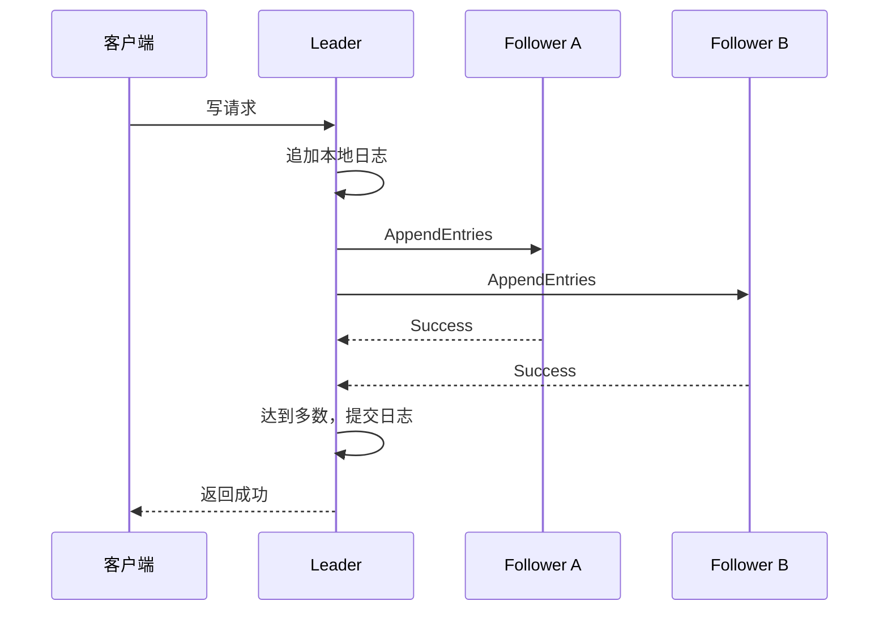

# Raft 协议：如何让分布式节点达成共识

Raft是一种分布式共识算法，用来解决：

> 多个节点分别保存系统副本时，如何在节点宕机、网络延迟和网络分区的情况下，对同一组操作及其执行顺序达成一致。

Raft的核心不是让所有节点同时完成操作，而是让多数节点确认一份唯一、有序、不可反转的日志，其余节点恢复后再追赶这份日志。

## 一、复制状态机

Raft不会直接比较每个节点最终的数据，而是同步一份操作日志：

```
1. SET x = 1
2. SET y = 2
3. ADD x 10
```

每个节点按照相同顺序执行相同命令：

```
相同初始状态
+ 相同操作日志
+ 相同执行顺序
= 相同最终状态
```

这就是复制状态机。

## 二、三种节点角色

Raft节点有三种角色：

| 角色      | 职责                           |
| --------- | ------------------------------ |
| Leader    | 接收客户端请求、排序并复制日志 |
| Follower  | 接收Leader的日志和心跳         |
| Candidate | Leader失联后参与选举           |

正常情况下，集群只有一个Leader，其他节点都是Follower。

```
客户端
   ↓
Leader
   ├── Follower A
   ├── Follower B
   └── Follower C
```

所有写请求由Leader排序，避免多个节点产生不同的日志顺序。

## 三、Term任期

Raft将运行时间划分为连续任期：

```
Term 1 → Term 2 → Term 3
```

每次选举都会进入新的Term。节点收到更大Term的消息时，必须更新自己的Term并转为Follower。

```
当前Term = 5
收到Term = 6
→ 更新为6
→ 退回Follower
```

Term用于识别过期Leader和过期消息。

## 四、选举超时

Follower会维护一个选举计时器。如果在选举超时时间内没有收到Leader的有效心跳，就认为Leader可能故障：

```
选举超时
→ 转为Candidate
→ Term加1
→ 给自己投票
→ 向其他节点请求投票
```

选举超时通常采用随机值，例如：

```
节点A：180ms
节点B：230ms
节点C：290ms
```

A更可能先发起选举，并在B、C超时前获得投票，从而减少多个Candidate同时竞选导致的平票。

选举超时不代表Leader一定宕机，也可能由网络延迟、长时间GC或CPU卡顿引起，因此它本质上是一种故障怀疑机制。

## 五、Leader选举

Candidate通过 `RequestVote` 请求其他节点投票。每个节点在一个Term内最多投一票。

假设有5个投票节点：

```
A、B、C、D、E
```

多数派为：

```
floor(5 / 2) + 1 = 3
```

Candidate获得至少3票后成为Leader。

任意两个多数派一定存在交集，而交集节点不能在同一Term投两票，因此正常Raft集群在同一Term内最多产生一个合法Leader。

## 六、节点如何知道多数派

节点总数来自持久化的集群成员配置，不是按照当前在线节点数量临时计算。

```
配置节点数：5
多数派：3
```

即使当前只有两个节点在线，多数派仍然是3。不能将多数派临时改成2，否则不同网络分区可能分别产生Leader。

参与投票的节点才计入多数派，Learner和普通只读副本一般不计入。

Candidate负责统计选票，Leader负责统计日志复制确认。Follower不需要自己判断某条日志是否达到多数，Leader会通过 `commitIndex` 通知它。

## 七、投票时检查日志

Follower不会只看Candidate的Term，还会比较日志新旧。Candidate会携带：

```
lastLogTerm
lastLogIndex
```

比较规则是：

```
最后一条日志Term更大 → 更新
Term相同，Index更大 → 更新
```

如果Candidate日志比自己旧，Follower会拒绝投票。

这样可以防止缺少已提交日志的节点成为Leader。

## 八、Leader如何通知其他节点

Candidate获得多数票后转为Leader，并立即向其他节点发送空的 `AppendEntries`：

```
AppendEntries {
    term: 6,
    leaderId: A,
    entries: [],
    leaderCommit: 10
}
```

空的 `AppendEntries` 就是心跳，不需要额外发送“我已当选”的特殊通知。

Follower收到后检查Term：

```
消息Term较小 → 拒绝
消息Term更大 → 更新Term并转为Follower
消息Term有效 → 接受Leader并重置选举计时器
```

## 九、日志复制和提交

客户端提交命令后：

````
1. Leader将命令追加到本地日志
2. Leader向Follower发送AppendEntries
3. Follower持久化日志并返回成功
4. Leader收到多数节点确认
5. Leader推进commitIndex
6. 各节点将日志应用到状态机
7. Leader向客户端返回成功

````

多数派确认不要求所有节点同时成功。5个节点中，只要3个节点持久化日志，集群就可以继续提交。

## 十、日志冲突如何修复

`AppendEntries`会携带：

```
prevLogIndex
prevLogTerm
```

Follower检查自己对应位置的日志是否一致：

```
一致 → 接受后续日志
不一致 → 拒绝
```

Leader不断向前寻找双方共同日志位置，然后覆盖Follower未提交的冲突后缀。

```
Leader：   1 2 3 4 5
Follower： 1 2 3 8 9
```

修复后：

```
Leader：   1 2 3 4 5
Follower： 1 2 3 4 5
```

未提交日志可以被覆盖，已经提交的日志不能被覆盖。

## 十一、不完整节点能否成为Leader

节点可以缺少未提交日志，但不能缺少已经提交的日志。

例如：

```
A、B、C：日志到10
D、E：日志到8
```

日志10存在于多数节点A、B、C，已经提交。D想当选需要3票，即使D和E投票，也必须从A、B、C中获得至少一票，但这些节点会发现D的日志较旧并拒绝。

如果日志11只存在于旧Leader，尚未复制到多数节点：

```
A：日志到11
B、C、D、E：日志到10
```

A宕机后，B可以成为Leader。日志11没有形成共识，可以被丢弃。

```
可以丢失：未被多数派确认的日志
不能丢失：已经提交的日志
```

## 十二、网络分区

假设5个节点分裂为：

```
分区一：A、B
分区二：C、D、E
```

A即使是旧Leader，也只有两个节点，无法提交新日志。C、D、E拥有多数派，可以选出新Leader并继续工作。

网络恢复后：

```
旧Leader发现更大的Term
→ 退为Follower
→ 删除未提交的冲突日志
→ 同步新Leader日志
```

Raft允许多数派继续服务，禁止少数派提交，从而避免脑裂。

## 十三、如何防止伪造Leader

Raft通过Term和投票规则防止正常节点产生错误Leader，但经典Raft假设合法节点不会恶意违反协议。

工程上通常使用：

- mTLS双向认证；
- 节点证书；
- 成员白名单；
- 网络访问控制；
- 消息完整性校验。

这些措施可以防止外部攻击者伪造节点。如果合法节点已经被攻陷并主动撒谎，普通Raft无法抵抗，需要PBFT、HotStuff等拜占庭容错协议。

## 十四、Raft与两阶段提交

Raft和2PC解决的问题不同：

```
Raft：
多个副本对一份有序日志达成共识

2PC：
多个独立资源对事务统一提交或回滚
```

实际系统可以使用Raft复制事务协调器的日志：

```
Raft保证全局COMMIT决定不会因单节点宕机丢失
2PC通知数据库和消息队列执行该决定
```

Raft提升协调者的可用性，但不会自动让MySQL和消息队列组成原子事务。

## 总结

Raft通过以下机制达成共识：

```
随机选举超时触发选举
→ 多数派选出唯一Leader
→ Leader统一确定日志顺序
→ 日志复制到多数节点后提交
→ Term识别过期Leader
→ 日志匹配规则修复冲突
→ 少数派不能提交，避免脑裂
```

面试中可以概括为：

> Raft是一种基于Leader的分布式共识算法。节点通过随机选举超时和多数投票选出Leader，所有写请求由Leader排序并复制。当日志被多数节点持久化后即可提交。多数派交集、Term和日志新旧检查保证已提交日志不会因Leader切换而丢失；网络分区时只有多数派一侧可以继续工作。
